# Diagrama Entidade-Relacionamento
## Sistema Multi-Tenant de Gestão de Restaurantes

Este arquivo contém o diagrama ER em formato Mermaid. Para visualizar:
1. Copie o código abaixo
2. Cole em https://mermaid.live/
3. Ou use uma extensão Mermaid no VS Code

```mermaid
erDiagram
    TENANTS ||--o{ TENANT_SUBSCRIPTIONS : "possui"
    TENANT_PLANS ||--o{ TENANT_SUBSCRIPTIONS : "oferece"
    TENANTS ||--o{ USERS : "emprega"
    TENANTS ||--o{ CUSTOMERS : "atende"
    TENANTS ||--o{ TABLES : "possui"
    TENANTS ||--o{ CATEGORIES : "organiza"
    TENANTS ||--o{ PRODUCTS : "vende"
    TENANTS ||--o{ ORDERS : "registra"
    TENANTS ||--o{ TRANSACTIONS : "movimenta"
    TENANTS ||--o{ CASH_REGISTERS : "opera"
    
    CATEGORIES ||--o{ PRODUCTS : "classifica"
    
    ORDERS }o--|| TABLES : "ocupa"
    ORDERS }o--|| CUSTOMERS : "realiza"
    ORDERS }o--|| USERS : "atende"
    ORDERS ||--o{ ORDER_ITEMS : "contém"
    PRODUCTS ||--o{ ORDER_ITEMS : "compõe"
    
    CASH_REGISTERS ||--o{ CASH_MOVEMENTS : "registra"
    CASH_MOVEMENTS }o--|| USERS : "executa"
    CASH_MOVEMENTS }o--|| ORDERS : "relaciona"
    CASH_MOVEMENTS }o--|| TRANSACTIONS : "vincula"
    
    TRANSACTIONS }o--|| ORDERS : "paga"
    TRANSACTIONS }o--|| CUSTOMERS : "identifica"
    TRANSACTIONS }o--|| USERS : "processa"
    
    CASH_REGISTERS }o--|| USERS : "abre"
    CASH_REGISTERS }o--|| USERS : "fecha"

    TENANTS {
        bigint id PK
        varchar name
        varchar slug UK
        varchar database_name
        varchar domain
        enum status
        json settings
        timestamp created_at
        timestamp updated_at
    }

    TENANT_PLANS {
        bigint id PK
        varchar name
        varchar slug UK
        text description
        decimal price
        enum billing_cycle
        int trial_days
        json features
        json limits
        boolean is_active
        int sort_order
        timestamp created_at
        timestamp updated_at
    }

    TENANT_SUBSCRIPTIONS {
        bigint id PK
        bigint tenant_id FK
        bigint tenant_plan_id FK
        enum status
        date starts_at
        date expires_at
        decimal amount
        varchar payment_method
        date last_payment_date
        date next_payment_date
        text notes
        timestamp created_at
        timestamp updated_at
    }

    CUSTOMERS {
        bigint id PK
        bigint tenant_id FK
        varchar name
        varchar email
        varchar phone
        varchar cpf
        date birth_date
        int points
        enum level
        enum status
        text address
        text notes
        timestamp created_at
        timestamp updated_at
    }

    USERS {
        bigint id PK
        bigint tenant_id FK
        varchar name
        varchar email UK
        timestamp email_verified_at
        varchar password
        enum role
        varchar avatar
        json permissions
        enum status
        timestamp last_login
        varchar remember_token
        timestamp created_at
        timestamp updated_at
    }

    TABLES {
        bigint id PK
        bigint tenant_id FK
        varchar number
        int capacity
        enum status
        varchar location
        varchar qr_code
        text notes
        timestamp created_at
        timestamp updated_at
    }

    CATEGORIES {
        bigint id PK
        bigint tenant_id FK
        varchar name
        text description
        varchar icon
        varchar color
        int sort_order
        boolean is_active
        timestamp created_at
        timestamp updated_at
    }

    PRODUCTS {
        bigint id PK
        bigint tenant_id FK
        bigint category_id FK
        varchar name
        text description
        decimal price
        decimal cost
        varchar image
        varchar sku
        int stock_quantity
        boolean stock_control
        boolean is_available
        int preparation_time
        int calories
        json allergens
        json tags
        timestamp created_at
        timestamp updated_at
    }

    ORDERS {
        bigint id PK
        bigint tenant_id FK
        bigint table_id FK
        bigint customer_id FK
        bigint user_id FK
        varchar order_number UK
        enum status
        enum type
        decimal subtotal
        decimal discount
        decimal service_fee
        decimal delivery_fee
        decimal total
        enum payment_status
        varchar payment_method
        text notes
        text cancelled_reason
        timestamp delivered_at
        timestamp created_at
        timestamp updated_at
    }

    ORDER_ITEMS {
        bigint id PK
        bigint order_id FK
        bigint product_id FK
        int quantity
        decimal unit_price
        decimal subtotal
        decimal discount
        decimal total
        text notes
        enum status
        timestamp created_at
        timestamp updated_at
    }

    TRANSACTIONS {
        bigint id PK
        bigint tenant_id FK
        bigint order_id FK
        bigint customer_id FK
        bigint user_id FK
        enum type
        varchar category
        decimal amount
        varchar payment_method
        text description
        enum status
        timestamp transaction_date
        text notes
        timestamp created_at
        timestamp updated_at
    }

    CASH_REGISTERS {
        bigint id PK
        bigint tenant_id FK
        varchar name
        decimal opening_balance
        decimal current_balance
        enum status
        bigint opened_by FK
        bigint closed_by FK
        timestamp opened_at
        timestamp closed_at
        text notes
        timestamp created_at
        timestamp updated_at
    }

    CASH_MOVEMENTS {
        bigint id PK
        bigint tenant_id FK
        bigint cash_register_id FK
        bigint user_id FK
        enum type
        decimal amount
        varchar description
        text notes
        bigint order_id FK
        bigint transaction_id FK
        enum payment_method
        timestamp movement_date
        timestamp created_at
        timestamp updated_at
    }
```

## Legenda

### Cardinalidades
- `||--o{` : Um para muitos (1:N)
- `}o--||` : Muitos para um (N:1)
- `||--||` : Um para um (1:1)
- `}o--o{` : Muitos para muitos (N:N)

### Tipos de Dados
- `PK` : Primary Key (Chave Primária)
- `FK` : Foreign Key (Chave Estrangeira)
- `UK` : Unique Key (Chave Única)

### Status e Enums Principais

**Tenant Status:**
- active, inactive, suspended

**Customer Level:**
- bronze, silver, gold, platinum

**User Role:**
- admin, manager, employee

**Table Status:**
- available, occupied, reserved, maintenance

**Order Status:**
- pending, confirmed, preparing, ready, delivered, cancelled

**Order Type:**
- dine_in, takeaway, delivery

**Transaction Type:**
- income, expense

**Cash Movement Type:**
- deposit, withdrawal, sale, expense

**Payment Methods:**
- cash, card, pix, other